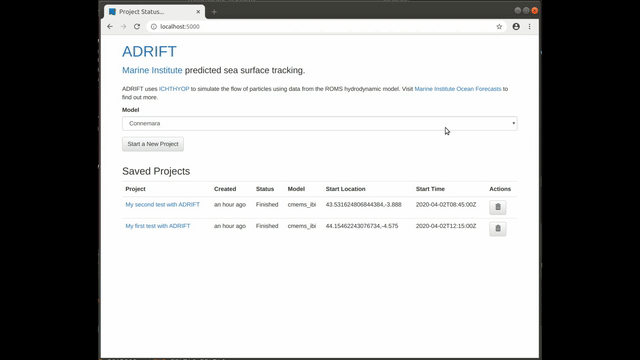

# adrift
Project for connecting java-based particle transport models to modern web visualisations



# Overview

Adrift provides a web frontend for [Ichthyop](http://www.ichthyop.org) giving a way for less technical
users to generate model output and visualisations once the hard work has been done by the oceanographer.

The action is performed by accepting a small number of inputs from the user (location, start time, duration, radius),
which are merged into an Ichthyop input xml template at runtime.

The output is available for display in the web browser, and for download as netcdf.

# Configuration

Before installation, the models available for production are listed in [models.json](adrift/blob/master/webapp/models.json).
Depending on your model type and the source of input data, three modes of operation are available

## models.json format
The format for models.json is an object keyed by the model id.
Example:
```json
  "cmems_ibi": {
    "id": "cmems_ibi", 
    "name": "cmems_ibi",
    "opendap_url": "http://thredds.marine.ie/thredds/dodsC/IMI_CMEMS/AGGREGATE",
    "nc_fetch_url": "http://thredds.marine.ie/thredds/dodsC/IMI_CMEMS/AGGREGATE?lon[{{lon_range}}],lat[{{lat_range}}],v[{{time_range}}][{{lat_range}}][{{lon_range}}],time[{{time_range}}],u[{{time_range}}][{{lat_range}}][{{lon_range}}]",
    "shrink_domain": true,
    "defaults": {
         "latitude": 45,
         "longitude": -6,
         "northwest_lat": 52,
         "northwest_lon": -4,
         "southeast_lat": 45,
         "southeast_lon": -8,
            "thickness": 2
    },
    "variables": {
     "latitude": "lat",
     "longitude": "lon",
     "time": "time"
    }
  }
``` 
<dl>
  <dt>id</dt>
  <dd>A short code id for the model; this must be the same as the key used to identify the model (cmems_ibi in the above example). It is used also in the name of the model template file, for example cmems_ibi.xml.mustache</dd>

  <dt>name</dt>
  <dd>The display name for the model; this will appear in the dropdown list on the main page</dd>
  
  <dt>opendap_url</dt>
  <dd>Required when the model is held in an from opendap server. In the examples provided, the opendap_url is used in both the cmems_ibi and NEATL models.</dd>

  <dt>nc_fetch_url</dt>
  <dd>Required when the model is held in an opendap server, but must be fetched locally using nccopy before processing. The url is in the form of a mustache template containing the placeholders: {{time_range}}, {{lat_range}} and {{lon_range}}</dd>

  <dt>shrink_domain</dt>
  <dd>Whether to provide the user with a box to allow a smaller area to be selected. This is useful to minimise data transfer and processing time where the data is fetched from opendap.</dd>

  <dt>defaults</dt>
  <dd>This section provides default parameters used for display and processing</dd>

  <dt>defaults.latitude</dt>
  <dd>Initial marker placement latitude.</dd>

  <dt>defaults.longitude</dt>
  <dd>Initial marker placement longitude</dd>

  <dt>defaults.northwest_lat</dt>
  <dd>Northwest corner</dd>

  <dt>defaults.northwest_lon</dt>
  <dd>Northwest corner</dd>

  <dt>defaults.southeast_lat</dt>
  <dd>Southeast corner</dd>

  <dt>defaults.southeast_lon</dt>
  <dd>Southeast corner</dd>

  <dt>defaults.thickness</dt>
  <dd>Thickness of the stain (note there is currently no user input for stain thickness)</dd>

  <dt>variables</dt>
  <dd>This section tells ADRIFT how to read the latitude longitude and time from the netcdf files or opendap connection.</dd>

  <dt>variables.latitude</dt>
  <dd>Name of the latitude variable/dimension</dd>

  <dt>variables.longitude</dt>
  <dd>Name of the longitude variable/dimension</dd>

  <dt>variables.time</dt>
  <dd>Name of the time variable/dimension</dd>
  
</dl>

## Mustache templates
For each model listed in models.json, a corresponding Ichthoyp configuration file is required. The Ichthyop file is named with the model id, contains some or all of the placeholders listed below, and has a [.mustache](https://mustache.github.io/) extension. For examples see:
File | Description
--- | ---
[connemara_his.xml.mustache](blob/master/webapp/connemara_his.xml.mustache) | ROMS 3d model with data on local file system
[neatl.xml.mustache](blob/master/webapp/neatl.xml.mustache) | ROMS 3d model with data in opendap
[cmems_ibi.xml.mustache](blob/master/webapp/cmems_ibi.xml.mustache) | Mercator 2D model with data in opendap

Having added an entry for your model into models.json file, you will create a template from your Ichthyop xml file, into the webapp folder, containing most or all of these placeholders:

<dl>
<dt>{{beginning}}</dt>
<dd>Use for value of the the initial_time parameter</dd>

<dt>{{depth}}</dt>
<dd>Use for value of the depth_stain parameter. Note there is no way for the user to change this value of this parameter at present.</dd>

<dt>{{duration}}</dt>
<dd>Use for value of the transport_duration parameter</dd>

<dt>{{input_path}}</dt>
<dd>Use for the value of the input_path parameter where the input files are on the local filesystem</dd>

<dt>{{latitude}}</dt>
<dd>Use for the value of the lat_stain parameter</dd>

<dt>{{longitude}}</dt>
<dd>Use for the value of the lon_stain parameter</dd>

<dt>{{opendap_url}}</dt>
<dd>The URL of the opendap aggregate; Use for the value of the opendap_url parameter.</dd>

<dt>{{output_file_prefix}}</dt>
<dd>TUse for the value of the file_prefix parameter in the main output section</dd>

<dt>{{output_path}}</dt>
<dd>Use for the value of the output_path parameter in the main output section</dd>

<dt>{{radius}}</dt>
<dd>Use for the value of the radius_stain parameter</dd>

<dt>{{release_dir}}</dt>
<dd>Use for the input_path parameter where the data is fetched from opendap by ADRIFt (see nc_fetch_url above). This is the case for the cmems_ibi example. Note in this case the value of grudu_pattern and gridv_pattern parameters must both be set to input.nc</dd>

<dt>{{#shrink_domain}}true{{/shrink_domain}}{{^shrink_domain}}false{{/shrink_domain}}</dt>
<dd>Use for the value of shrink_domain parameter for an opendap model</dd>

<dt>{{thickness}}</dt>
<dd>Can be used for the value of the thickness_stain parameter. Note there is no way for the user to change this value of this parameter at present.</dd>
</dl>

# installation
Before installing, download [ichthyop-3.3.3.zip](http://www.ichthyop.org/system/files/downloads/ichthyop_3.3.3_1.zip) into the folder.

NB: the current cmems_ibi configuration works only with an older version [Ichthyop 3.3_r1037](http://www.ichthyop.org/system/files/downloads/ichthyop-v3u3.zip)

```bash
docker build -t adrift .
```


# nfs mount
(This section is specific to Marine Institute)
Connect ROMS output to the host server.

1. Install the autofs package if it’s not already installed
2. put the attached auto.prometheus file in the /etc folder
3. add the following line to the /etc/auto.master file (which should exist if autofs is installed)
  * ```/mnt/prometheus /etc/auto.prometheus --ghost --timeout=60 --verbose```
4. create new folder: /mnt/prometheus
5. restart autofs: /etc/init.d/autofs restart


# fetching some model data data files from the main demo server
(This section is specifict to Marine institute)
```bash
mkdir -p input/connemara_his
cd input/connemara_his
read username
read password
for item in 18 19 20 21 22 23 24 25; do wget --user=$username --password=$password "https://adrift.demo.marine.ie/nc/CONN_20180406${item}.nc"; done
```

# running

```bash
docker run -d --restart=always \
-v /mnt/prometheus/shared/model/ROMS/OUTPUT/Connemara/FC/WEEK_ARCHIVE/:/input/connemara_his \
-v /home/opsuser/dev/docker-ichthyop/output:/output \
-p 80:5000 --name=adrift adrift
```

# Running in Docker Swarm

```bash
docker build -t 127.0.0.1:5000/adrift .
docker push 127.0.0.1:5000/adrift
```

Running in docker-compose also check the docs to create the [htaccess password file](https://github.com/jwilder/nginx-proxy#basic-authentication-support)


## example docker swarm
```docker service create --name adrift --label traefik.port=5000 --label traefik.domain=dm.marine.ie --network traefik-net --mount type=bind,src=/opt/adrift/output,dst=/output --mount type=bind,src=/opt/thredds/connemara_his/,dst=/input/connemara_his --constraint node.hostname=="dmdock04" 127.0.0.1:5000/adrift:latest ```

# on server iapetus
(Specifict to Marine Institute)

```shell
cd /home/opsuser/dev/adrift
docker stop adrift && docker rm adrift
docker run -d --name=adrift --restart=always -v /home/DATA/ROMS/OUTPUT/Connemara/FC/WEEK_ARCHIVE/:/input/connemara_his -v /home/DATA/CMEMS:/input/cmems_ibi -v $(pwd)/output:/output -p 80:5000 127.0.0.1:5000/adrift
```
